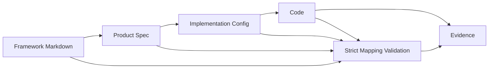
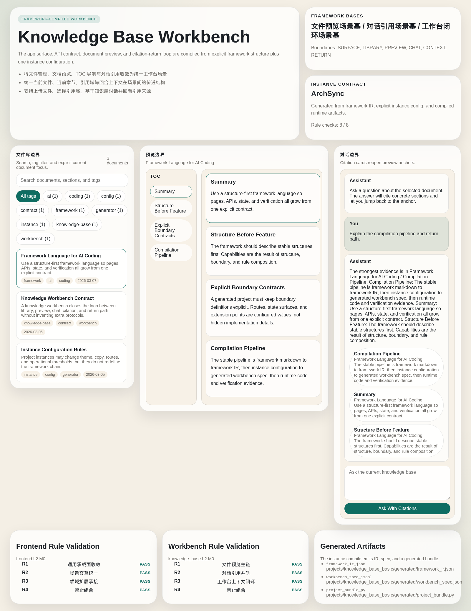

# Shelf

[](./pyproject.toml)
[](https://github.com/astral-sh/uv)
[](./tools/vscode/archsync)
[](https://github.com/xueyu888/framework/stargazers)

**Structure-first AI coding framework.**

Shelf turns design into an executable engineering system.

Instead of asking AI to "just write code", Shelf gives AI a real structure to work inside:

- `framework/*.md` defines reusable framework structure
- `projects/<project_id>/product_spec.toml` fixes product truth
- `projects/<project_id>/implementation_config.toml` fixes one implementation path
- `scripts/materialize_project.py` materializes artifacts
- `scripts/validate_strict_mapping.py` checks whether the chain is still consistent

中文一句话：**Shelf 不是 prompt-first 的 AI 编程工具，而是把设计先写成结构语言，再让 AI 在这个结构里写代码。**

> If you think design is the real bottleneck in AI coding, Shelf is built for that problem.

## Why Shelf Exists

Most AI coding tools are good at speeding up implementation.

They are much worse at preserving:

- architectural boundaries
- product truth
- implementation traceability
- evidence that the generated result still matches the original design

Shelf is opinionated about that gap.

It treats AI coding as a convergence chain:

`Framework -> Product Spec -> Implementation Config -> Code -> Evidence`

That is the core idea of this repository.

## What Makes Shelf Different

| Typical AI coding repo | Shelf |
| --- | --- |
| Prompt-first | Structure-first |
| Specs as helper docs | Framework docs as first-class source |
| Product and implementation often mixed together | `Product Spec` and `Implementation Config` are explicitly separated |
| Code becomes the default truth | Code is downstream from framework and config |
| Validation is optional | Strict mapping validation is built in |
| Generated output is the end | Generated output is evidence, not the source of truth |

Shelf is not trying to be another chat wrapper, prompt pack, or generic agent shell.

It is trying to be a **framework-native language for AI coding**.

## The Core Model



This repository is organized around that flow:

- **Framework**
  - reusable structure, boundaries, bases, rules, verification
- **Product Spec**
  - what the product finally is
- **Implementation Config**
  - how that product lands in one technical realization path
- **Code**
  - runtime templates, generator core, validators
- **Evidence**
  - generated artifacts, validation outputs, runnable examples

## What You Get

- **Executable framework specs**
  - Define capability, boundary, base, combination rule, and verification in `framework/<module>/Lx-Mn-*.md`.
- **Strict mapping validation**
  - Check whether framework docs, project configs, generated artifacts, and runtime code still align.
- **Project materialization**
  - Materialize project artifacts from framework docs plus instance configs.
- **Framework-aware VS Code tooling**
  - Use ArchSync to inspect framework trees, jump across mappings, and run validation from the editor.
- **Runnable reference application**
  - Run a knowledge-base demo compiled from framework markdown, product spec, and implementation config.

## See The System, Not Just The Pitch

<p align="center">
  
</p>

The screenshot above is a real reference app from this repository.

It is derived from the same chain described in this README:

`framework/*.md -> product_spec.toml -> implementation_config.toml -> generated/* -> runtime app`

Shelf is meant to be inspectable proof, not just a design manifesto.

## Who Shelf Is For

- Teams exploring **AI-assisted software engineering** beyond prompt engineering
- Builders who believe **design should survive implementation**
- People doing **spec-driven development**, but who want stronger structure and validation
- Teams building internal tools, knowledge apps, or framework-heavy products that need traceability

## Quick Start

### 1. Install dependencies

```bash
uv sync
```

### 2. Enable the required git hook

```bash
bash scripts/install_git_hooks.sh
```

### 3. Run the core validations

```bash
uv run mypy
uv run python scripts/validate_strict_mapping.py
uv run python scripts/validate_strict_mapping.py --check-changes
```

### 4. Materialize project artifacts

```bash
uv run python scripts/materialize_project.py
```

### 5. Start the demo app

```bash
uv run python src/main.py
```

For local development with reload:

```bash
uv run python src/main.py --reload
```

Default entry points:

- App: `http://127.0.0.1:8000/knowledge-base`
- Product Spec API: `http://127.0.0.1:8000/api/knowledge/product-spec`
- Documents API: `http://127.0.0.1:8000/api/knowledge/documents`

Legacy shelf reference output is still available:

```bash
uv run python src/main.py reference-shelf
```

## Start Here

If you only read three things, read these first:

- [Repository structure and top-level rules](./specs/规范总纲与树形结构.md)
- [Core framework design standard](./specs/框架设计核心标准.md)
- [Knowledge-base product spec example](./projects/knowledge_base_basic/product_spec.toml)

If you want to inspect a concrete framework module:

- [Knowledge-base UI skeleton](./framework/knowledge_base/L1-M0-知识库界面骨架模块.md)
- [Shelf domain framework standard](./framework/shelf/L2-M0-置物架框架标准模块.md)

## How A Project Compiles Inside Shelf

1. **Write framework modules**
   - Use framework markdown to declare reusable structure, boundaries, bases, rules, and verification.
2. **Fix product truth**
   - Use `projects/<project_id>/product_spec.toml` to declare what the product is.
3. **Choose one implementation path**
   - Use `projects/<project_id>/implementation_config.toml` to refine the product into a concrete technical realization.
4. **Materialize artifacts**
   - Generate `projects/<project_id>/generated/*` from framework plus config inputs.
5. **Validate the chain**
   - Run strict mapping checks to catch structural drift.
6. **Run and inspect**
   - Launch the demo app and inspect the framework graph in ArchSync.

## Reference Demo: Knowledge Base Workbench

This repository includes a runnable demo that shows the full chain:

`framework/*.md + product_spec.toml + implementation_config.toml -> generated/* -> runtime app`

Useful entry points:

- [Project layer guide](./projects/README.md)
- [Product Spec](./projects/knowledge_base_basic/product_spec.toml)
- [Implementation Config](./projects/knowledge_base_basic/implementation_config.toml)
- [Generated artifacts](./projects/knowledge_base_basic/generated/)
- [Runtime templates](./src/knowledge_base_runtime/)

Manual materialization for the current project:

```bash
uv run python scripts/materialize_project.py --project projects/knowledge_base_basic/product_spec.toml
```

## ArchSync VS Code Extension

ArchSync is the companion extension for Shelf.

It is not a generic chat assistant. It is a **framework-aware AI coding companion** for this repository model.

It provides:

- framework tree browsing
- mapping-aware navigation
- validation commands inside VS Code
- issue surfacing in the Problems panel
- a template entrypoint for framework authoring

Local install:

```bash
bash tools/vscode/archsync/install_local.sh
```

The local install script rebuilds the VSIX from the current source version and force-installs it into local VS Code.

More:

- [ArchSync README](./tools/vscode/archsync/README.md)
- [GitHub Releases](https://github.com/xueyu888/framework/releases)

Main commands:

- `ArchSync: Open Framework Tree`
- `ArchSync: Refresh Framework Tree`
- `ArchSync: Validate Mapping Now`
- `ArchSync: Show Mapping Issues`

## Repository Layout

- `specs/`
  - top-level standards and code quality rules
- `framework/`
  - reusable framework modules by domain
- `projects/`
  - product specs, implementation configs, generated outputs
- `mapping/`
  - machine-readable mapping registry
- `scripts/`
  - materialization, validation, release, and support scripts
- `src/`
  - runtime templates, generator core, validators
- `tools/vscode/archsync/`
  - the companion VS Code extension

## Engineering Rules

This repository is strict on purpose:

- use `uv` for Python environment and dependencies
- do not manually edit `projects/<project_id>/generated/*`
- change framework or project source files first, then materialize artifacts
- pass strict mapping validation before pushing
- follow the release standard in [发布与版本说明标准.md](./specs/code/发布与版本说明标准.md)

Guard rails:

- local pre-push hook: `.githooks/pre-push`
- CI gate: `.github/workflows/strict-mapping-gate.yml`

## Project Status

Shelf is currently an **active framework repository with a runnable reference app**.

Public-facing pieces already in the repo:

- a runnable knowledge-base workbench demo
- strict mapping validation in local workflows and CI
- a companion VS Code extension with release automation
- framework, product, implementation, and evidence layers in one repository model

## Why This Matters

AI coding gets easier every month.

Keeping structure, design intent, implementation boundaries, and generated evidence aligned does not.

Shelf is built for teams that want AI to operate inside a **real engineering language**, not just inside a longer prompt.

If that matches how you think about software, start with the core standard:

- [框架设计核心标准.md](./specs/框架设计核心标准.md)
